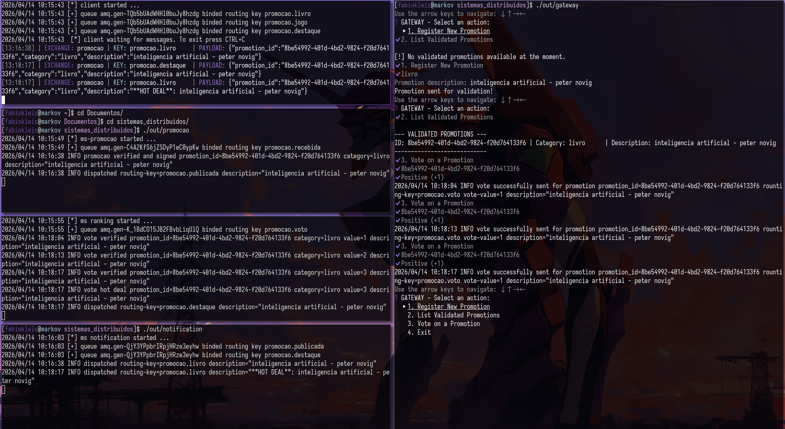

#+TITLE: Sistema de Promoção - Sistemas Distribuídos
#+AUTHOR: Fabio Kleis
#+DATE: 2026-04-12
#+DESCRIPTION: Documentação do trabalho sistema promoção: Microsserviços, Sistema de Mensageria, Criptografia de Chave Assimétrica.

trabalho sistema de promoção, para a comunicação dos microsserviços foi utilizado o middleware Rabbitmq.

** Protobuf
os microsserviços utilizam protobuf para comunicação.
instale o protoc e o plugin para golang, para nixos execute:
#+BEGIN_SRC bash
nix-shell -p protoc-gen-go
#+END_SRC

** RabbitMQ
para executar um broker rabbitmq localmente com docker: 
#+BEGIN_SRC bash
docker run --detach --hostname rabbitmq --name promocao-rabbitmq \
    --env RABBITMQ_DEFAULT_USER=promocao \
    --env RABBITMQ_DEFAULT_PASS=1234 \
    --publish 15672:15672 \
    --publish 5672:5672 \
     rabbitmq:management
#+END_SRC

** Build & Run
os microsserviços foram escritos em Golang e foi feito um arquivo
Makefile.

Para compilar todos os microsserviços:
#+BEGIN_SRC bash
make 
#+END_SRC

Gere as chaves em keys executando:
#+BEGIN_SRC
make gen-keys
#+END_SRC

Para remover os binários:
#+BEGIN_SRC bash
make clean
#+END_SRC

** Exemplo

